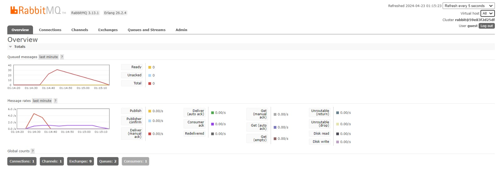

# **Rust Tutorial & Exercise**
**Muhammad Hilal Darul Fauzan** 
**2206830542** 
**Pemrograman Lanjut C** 

## **Tutorial Modul 8: Software Architecture**

a. What is amqp?
- AMQP merupakan singkatan dari Advanced Message Queuing Protocol. AMQP adalah sebuah *open standard application layer protocol* yang difokuskan pada *message-oriented middleware*. Protokol ini memungkinkan aplikasi *client* untuk berkomunikasi dengan aplikasi sumber yang mengirimkan data serta menggunakan *messaging middleware* untuk menerima informasi yang dibutuhkan.

b. What it means? `guest:guest@localhost:5672` , what is the first guest, and what is the second guest, and what is `localhost:5672` is for? 
- String `guest:guest@localhost:5672` merupakan string koneksi untuk server AMQP. Dalam string ini, `guest:guest` adalah *username* dan *password* yang digunakan untuk autentikasi ke server, di mana dalam kasus ini *username* dan *password* keduanya adalah "guest". Selanjutnya, `localhost` menunjukkan hostname dari server, yang berarti server tersebut berjalan pada mesin yang sama dengan *client*. Lalu, `5672` adalah nomor port yang digunakan oleh server untuk mendengarkan permintaan dan merupakan port default untuk AMQP.

Lampiran *simulation slow subscriber*

Berdasarkan lampiran di atas, terlihat adanya akumulasi 30 *queued message* pada waktu tertentu. Hal ini terjadi karena adanya penundaan dalam penerimaan message oleh Subscriber yang tidak mampu memproses message secepat message yang dikirim oleh Publisher. Kondisi ini diperparah dengan dilakukannya *cargo run* berulang kali pada Publisher yang meningkatkan jumlah message yang diterima oleh Subscriber. Hal ini dapat mengakibatkan Subscriber kelebihan beban karena harus memproses terlalu banyak message secara bersamaan. Oleh karena itu, ketidakseimbangan antara kecepatan pengiriman message oleh Publisher dan kecepatan pemrosesan oleh Subscriber bisa menyebabkan penumpukan message dalam queue.